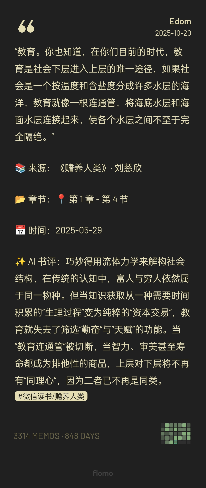

<div align="center">
    
    <h1>WeRead2Flomo</h1>
    <h3><em>将阅读转化为知识，让思考永不丢失</em></h3>
</div>

<p align="center">
    <strong>同步微信读书划线到 Flomo，支持 AI 摘要、智能标签、定时同步等功能</strong>
</p>

<p align="center">
    <a href="https://github.com/blessonism/weread2flomo/stargazers"></a>
    <a href="https://github.com/blessonism/weread2flomo/blob/main/LICENSE"></a>
    <a href="https://www.python.org/"></a>
    <a href="https://github.com/blessonism/weread2flomo/issues"></a>
    <a href="https://weread2flomo.sukisq.me"></a>
</p>


---

## 📸 项目效果图

<details>
<summary><strong>点击查看运行效果</strong></summary>
<br/>

<div align="center">
    <!-- 请在此处替换为实际的项目截图 -->
  
    <!-- <br/> -->
    <!--  -->

</div>

</details>

---

## 目录

- [✨ 为什么选择 WeRead2Flomo？](#-为什么选择-weread2flomo)
- [🚀 快速开始](#-快速开始)
- [🎯 功能特性](#-功能特性)
- [📖 模板展示](#-模板展示)
- [⚙️ 配置指南](#️-配置指南)
- [🤖 AI 功能](#-ai-功能)
- [🔄 自动化部署](#-自动化部署)
- [💡 使用场景](#-使用场景)
- [📊 API 限制](#-api-限制)
- [🔧 高级用法](#-高级用法)
- [❓ 常见问题](#-常见问题)
- [🎨 路线图](#-路线图)
- [🙏 致谢](#-致谢)
- [📄 许可证](#-许可证)

---

## ✨ 为什么选择 WeRead2Flomo？

在微信读书中划线是容易的，但这些想法很快就会被遗忘。WeRead2Flomo 帮你：

- 🔄 **自动同步** - 无需手动复制，每天定时自动同步新划线
- 🤖 **AI 增强** - 自动生成摘要和智能标签，让内容更易检索
- 🎨 **灵活模板** - 三种内置模板 + 自定义，适配不同场景
- 📚 **智能分类** - 自动识别书籍类型，应用对应的标签体系
- ⚡ **开箱即用** - 简单配置，3 分钟开始使用

---

## 🚀 快速开始

### 前置要求

- Python 3.8+
- 微信读书账号
- Flomo 账号

### 安装步骤

#### 1. 克隆项目

```bash
git clone https://github.com/blessonism/weread2flomo.git
cd weread2flomo
```

#### 2。 安装依赖

```bash
pip install -r requirements.txt
```

#### 3. 配置环境变量

创建 `.env` 文件：

```bash
# ==================== Cookie Cloud 配置（推荐）====================
# 自动同步浏览器 Cookie，无需手动更新
CC_URL="https://cc.chenge.ink"
CC_ID="你的UUID"
CC_PASSWORD="你的密码"

# ==================== 备用 Cookie 配置 ====================
# 如果不使用 Cookie Cloud，可以手动配置
# WEREAD_COOKIE="你的微信读书Cookie"

# ==================== Flomo API 配置（必需）====================
FLOMO_API="https://flomoapp.com/iwh/你的API密钥/"

# ==================== AI 配置（可选）====================
# 启用 AI 摘要和智能标签
AI_API_KEY="你的AI API Key"

# 其他 AI 配置在 config.yaml 中设置
```

> 📖 **详细配置教程**：
> - [Cookie Cloud 配置指南](docs/COOKIE_CLOUD_GUIDE.md)（推荐，自动更新）
> - [手动获取 Cookie](docs/COOKIE_GUIDE.md)（简单快速）
> - [完整配置说明](docs/CONFIG_GUIDE.md)

#### 4. 运行同步

```bash
# 完整同步
python sync.py

# 测试单条划线（推荐首次使用）
python test_single_highlight.py
```

#### 5. 查看结果

打开你的 Flomo，享受自动同步的读书笔记！

---

## 🎯 功能特性

### 核心功能

| 功能 | 状态 | 说明 |
|------|------|------|
| 📝 **自动同步** | ✅ | 定时同步微信读书新划线到 Flomo |
| 🎨 **多模板系统** | ✅ | 简洁/标准/详细三种模板 + 自定义 |
| 🤖 **AI 智能摘要** | ✅ | 为长划线自动生成一句话概述 |
| 🏷️ **AI 智能标签** | ✅ | 自动提取主题，生成精准标签 |
| 📚 **书籍分类** | ✅ | 工作/成长/文学/技术自动分类 |
| ⏱️ **时间筛选** | ✅ | 只同步最近 N 天的划线 |
| 🔄 **增量同步** | ✅ | 自动去重，只同步新内容 |
| 🍪 **Cookie Cloud** | ✅ | 自动同步浏览器 Cookie，无需手动更新 |

### 高级特性

- ⚙️ **灵活配置** - 支持环境变量和 YAML 配置文件
- 🔐 **隐私保护** - 所有数据本地处理，不上传第三方
- 📊 **详细日志** - 完整的同步记录和统计信息
- 🔧 **高度可扩展** - 易于添加新模板和自定义逻辑
- ⚡ **高性能** - 智能去重和缓存机制

---

## 📖 模板展示

### 📌 简洁模板（推荐用于快速记录）

```
人们总是高估自己的理性，低估直觉的作用

📖 《思考，快与慢》· 丹尼尔·卡尼曼

📍 第三章 - 启发法与偏见

✨ AI 摘要：决策中直觉与理性的角力，理性常被高估。

#微信读书/思考快与慢 #认知偏差 #心理学
```

### 📋 标准模板（均衡选择）

```
📖 《番茄工作法图解》- Francesco Cirillo

> 采用番茄工作法，25分钟专注+5分钟休息，可以显著提高工作效率

📍 第2章 - 基本原则
🔗 https://weread.qq.com/web/reader/xxx

💭 我的思考：可以试试用来写代码，看能不能对抗焦虑

#微信读书/番茄工作法图解 #时间管理 #效率 #个人成长
```

### 📑 详细模板（深度阅读）

```
采用番茄工作法，25分钟专注+5分钟休息，可以显著提高工作效率

📚 来源：《番茄工作法图解》· Francesco Cirillo

📂 章节：第2章 - 基本原则

📅 时间：2024-10-17

✨ AI 摘要：专注25分钟，休息5分钟，番茄工作法让效率翻倍。

💭 我的思考：可以试试用来写代码，看能不能对抗焦虑

#微信读书/番茄工作法图解 #时间管理 #效率提升 #工作
```

---

## ⚙️ 配置指南

### 配置优先级

**环境变量（.env）> YAML 配置（config.yaml）> 默认值**

- **`.env`** - 敏感信息（Cookie、API Key）和环境相关配置
- **`config.yaml`** - 业务配置（模板、标签规则、分类等）

### 核心配置项

#### 必填配置

| 配置项 | 环境变量 | 说明 |
|--------|----------|------|
| 微信读书认证 | `CC_URL` + `CC_ID` + `CC_PASSWORD`<br/>或 `WEREAD_COOKIE` | Cookie Cloud（推荐）或手动 Cookie |
| Flomo API | `FLOMO_API` | Flomo 官方 API 地址 |

#### 同步配置

| 配置项 | 环境变量 | 默认值 | 说明 |
|--------|----------|--------|------|
| 时间限制 | `SYNC_DAYS_LIMIT` | 100 | 只同步最近 N 天的划线 |
| 最大数量 | `SYNC_MAX_HIGHLIGHTS` | 50 | 每次最多同步 N 条 |
| 同步笔记 | `SYNC_REVIEWS` | true | 是否同步笔记（不仅是划线）|

#### AI 配置

| 配置项 | 环境变量 | 说明 |
|--------|----------|------|
| AI 提供商 | `AI_PROVIDER` | `openai`（推荐）/ `local` / `none` |
| API 密钥 | `AI_API_KEY` | OpenAI 格式的 API Key |
| API 地址 | `AI_API_BASE` | 支持所有 OpenAI 兼容服务 |
| 模型名称 | `AI_MODEL` | 如 `gpt-5`、`claude-4.5-sonnet` 等 |

> 📖 **完整配置文档**：[CONFIG_GUIDE.md](docs/CONFIG_GUIDE.md)

---

## ✨ AI 功能

### AI 智能摘要

**为长划线自动生成一句话概述**

```yaml
# config.yaml
ai:
  enable_summary: true
  summary_min_length: 100  # 触发摘要的最小字符数
```

**示例效果：**

原文（171字符）：
> 我们来到一个热带岛屿，在滴滴涕的帮助下，我们消灭了疟疾，在两三年内，拯救了数十万人的生命。这显然是好事。但这数十万被救活的人，以及他们繁衍出的数以百万计的后代，没有衣服穿，没有房子住，无法接受教育...

AI 提炼：
> ✨ **消灭疟疾本是救命之举，却让岛上数百万新生的人口陷入饥饿、拥挤和无尽的悲惨。**

### AI 智能标签

**自动提取划线主题，生成精准标签**

```yaml
# config.yaml
tags:
  enable_ai_tags: true
  max_ai_tags: 3  # 最多生成 3 个 AI 标签
```

**示例效果：**

划线内容：
> 在金字塔结构中，各层级的重要性一般由上而下逐层递减，顶层的中心思想最为重要...

AI 生成标签：
> `#金字塔结构` `#逻辑思维` `#沟通技巧`

### 支持的 AI 服务

- [x] **所有 OpenAI 兼容服务**（国内镜像等）
- [x] **本地规则引擎**（无需 API，基于关键词匹配）

---

## 🔄 自动化部署

### GitHub Actions（推荐）

**每天自动同步，无需本地运行**

#### 步骤：

1. **Fork 本仓库**

2. **配置 Secrets**
   - 进入 `Settings` → `Secrets and variables` → `Actions`
   - 添加以下 Secrets：
     - `CC_URL`（Cookie Cloud 地址）
     - `CC_ID`（Cookie Cloud UUID）
     - `CC_PASSWORD`（Cookie Cloud 密码）
     - `FLOMO_API`（Flomo API 地址）
     - `AI_API_KEY`（AI API Key，可选）

3. **启用 Actions**
   - 进入 `Actions` 标签页
   - 启用工作流

4. **完成！**
   - 每天 UTC 00:00（北京时间 08:00）自动同步
   - 也可以手动触发：`Actions` → `WeRead to Flomo Sync` → `Run workflow`

> **详细教程**：[GitHub Actions 配置指南](docs/GITHUB_ACTIONS_GUIDE.md)

### 调整运行时间

编辑 `.github/workflows/sync.yml` 中的 `schedule` 部分：

```yaml
schedule:
  - cron: '0 0 * * *'    # 每天 UTC 00:00（北京时间 08:00）
```

**常用 Cron 表达式：**

| 表达式 | 说明 | 北京时间 |
|--------|------|----------|
| `0 0 * * *` | 每天一次 | 08:00 |
| `0 0,12 * * *` | 每天两次 | 08:00, 20:00 |
| `0 */6 * * *` | 每 6 小时 | 08:00, 14:00, 20:00, 02:00 |
| `0 22 * * *` | 每天一次 | 06:00 |
| `0 0 * * 1` | 每周一 | 08:00 |

**Cron 语法：**
```
┌─────────── 分钟 (0 - 59)
│ ┌───────── 小时 (0 - 23)
│ │ ┌─────── 日 (1 - 31)
│ │ │ ┌───── 月 (1 - 12)
│ │ │ │ ┌─── 星期 (0 - 6, 0 = 周日)
│ │ │ │ │
* * * * *
```

---

## 💡 使用场景

### 场景 1：快速积累灵感

使用**简洁模板**，专注于划线内容本身，快速积累想法。

```yaml
default_template: simple
```

### 场景 2：主题式阅读

开启 **AI 标签**，自动提取主题，方便后续按主题检索。

```yaml
tags:
  enable_ai_tags: true
```

### 场景 3：深度阅读笔记

使用**详细模板**，记录完整的阅读上下文和个人思考。

```yaml
default_template: detailed
sync_reviews: true
```

### 场景 4：分类管理

配置**书籍分类**，不同类型的书自动使用不同标签和模板。

```yaml
book_categories:
  work:
    keywords: ["管理", "商业", "职场"]
    tags: ["#工作", "#职场"]
    template: "standard"
```

---

## 📊 API 限制

| 服务 | 限制 | 说明 |
|------|------|------|
| **Flomo** | 100 次/天 | 官方 API 限制 |
| **微信读书** | 建议 1 秒/次 | 避免触发风控 |
| **OpenAI** | 根据套餐 | 按账号配额 |
| **其他 AI 服务** | 根据套餐 | 按服务商规则 |

### 优化建议

- 设置合理的 `days_limit`（如 30-100 天）
- 控制 `max_highlights_per_sync`（如 20-50 条）
- 首次同步建议分批进行，避免超出限制

---

## 🔧 高级用法

### 自定义模板

在 `config.yaml` 中添加你的模板：

```yaml
templates:
  custom:
    name: "我的模板"
    description: "适合个人风格"
    format: |
      💡 {highlight_text}
      
      来自《{book_title}》by {author}
      
      {ai_summary_section}{tags}

default_template: custom
```

### 扩展书籍分类

添加新的分类规则：

```yaml
book_categories:
  science:
    keywords:
      - "物理"
      - "化学"
      - "生物"
      - "科学"
    tags:
      - "#科学"
      - "#知识"
    template: "detailed"
```

### 自定义 AI 提示词

修改 AI 标签或摘要的生成逻辑：

```yaml
ai:
  tag_prompt: |
    请为以下划线生成 1-3 个标签...
    
  summary_prompt: |
    请用一句话总结以下内容的核心观点...
```

### 使用本地 AI（无需 API）

```yaml
ai:
  provider: local
  
tags:
  enable_ai_tags: true
```

系统会使用内置的关键词规则生成标签。

## 📝 常见问题

<details>
<summary><strong>Q: 如何获取微信读书 Cookie？</strong></summary>

**方式 1：Cookie Cloud（推荐）**
- 安装浏览器插件
- 配置服务器和密钥
- 自动同步，无需手动更新
- 详见：[Cookie Cloud 配置指南](docs/COOKIE_CLOUD_GUIDE.md)

**方式 2：手动获取**
1. 浏览器访问 https://weread.qq.com/ 并登录
2. 按 F12 打开开发者工具
3. 切换到 Application/存储 标签
4. 找到 Cookies → weread.qq.com
5. 复制所有 Cookie 值
- 详见：[Cookie 获取指南](docs/COOKIE_GUIDE.md)

</details>

<details>
<summary><strong>Q: Cookie 会过期吗？</strong></summary>

会的。传统 Cookie 有效期较短（24小时）。

**解决方案：**
- 使用 **Cookie Cloud**（推荐）- 自动同步浏览器 Cookie
- 启用 Cookie 保活功能
- 使用 GitHub Actions 定时同步

</details>

<details>
<summary><strong>Q: AI 标签准确吗？</strong></summary>

准确率取决于 AI 服务：
- **GPT-5** - 匹配标签推荐
- **Claude-4.5-sonnet** - 摘要提取推荐
- **本地规则引擎** - 基于关键词匹配

建议开启后观察一段时间，根据效果调整配置。

</details>

<details>
<summary><strong>Q: 为什么有的划线没有同步？</strong></summary>

检查以下几点：
1. 是否达到 Flomo API 每日限制（100次）
2. 是否超出时间范围（`days_limit` 设置）
3. 是否已经同步过（检查 `synced_bookmarks.json`）
4. Cookie 是否过期

</details>

<details>
<summary><strong>Q: 如何重新同步所有划线？</strong></summary>

```bash
# 删除同步记录
rm synced_bookmarks.json

# 重新同步（注意 API 限制）
python sync.py
```

⚠️ 注意 Flomo API 每日限制（100次）

</details>

<details>
<summary><strong>Q: 可以同步到其他笔记工具吗？</strong></summary>

目前只支持 Flomo。

如需支持其他工具（Get 笔记 等），可以：
1. 参考 `src/flomo_client.py` 修改
2. 提交 Issue 或 PR
3. Fork 项目自行定制

</details>

<details>
<summary><strong>Q: 测试 AI 功能不生效？</strong></summary>

检查配置：
1. `.env` 中 `AI_API_KEY` 是否正确
2. `config.yaml` 中 `ai.enable_summary` 是否为 `true`
3. `config.yaml` 中 `tags.enable_ai_tags` 是否为 `true`
4. 划线长度是否达到 `summary_min_length`（默认 100 字符）

运行测试：
```bash
python test_single_highlight.py
```

</details>

<details>
<summary><strong>Q: GitHub Actions 定时任务为什么没有运行？</strong></summary>

**常见原因：**

1. **仓库不活跃** - GitHub 会在 60 天无活动后禁用 scheduled workflows
   - 解决：进入 `Actions` 页面，点击 `Enable workflow` 重新启用

2. **Actions 权限未设置** - 检查 `Settings` → `Actions` → `General`
   - 确保允许运行 Actions
   - 确保 Workflow permissions 设置为 `Read and write permissions`

3. **Secrets 未配置** - 检查必需的 Secrets 是否都已设置
   - 必需：`FLOMO_API` + (`WEREAD_COOKIE` 或 Cookie Cloud 配置)

4. **查看运行日志** - 进入 `Actions` 查看是否有运行记录和错误信息

</details>

<details>
<summary><strong>Q: GitHub Actions 运行失败怎么办？</strong></summary>

**排查步骤：**

1. 查看 Actions 运行日志，定位错误信息
2. 检查 Secrets 配置是否正确
3. 手动触发测试，查看是否能重现问题

**常见错误：**
- `Cookie invalid` - Cookie 过期，需要重新配置
- `403 Forbidden` - 检查 Flomo API 是否正确
- 权限错误 - 检查 Workflow permissions 设置

定时任务失败时会自动创建 Issue 提醒，查看 Issue 中的详细信息。

</details>

<details>
<summary><strong>Q: 如何查看 GitHub Actions 的同步记录？</strong></summary>

1. 进入 `Actions` 标签页查看运行历史
2. 点击具体运行记录查看日志
3. 下载 `Artifacts` 中的 `sync-records` 获取详细记录
4. 查看仓库的 `synced_bookmarks.json` 提交历史

</details>

<details>
<summary><strong>Q: 为什么定时任务实际运行时间和设置的不一样？</strong></summary>

GitHub Actions 的 `schedule` 不保证精确时间：
- **只保证不早于设定时间**，延迟 5 分钟到 2 小时都属正常
- **延迟受服务器负载影响**，UTC 00:00（北京时间 08:00）是全球高峰，延迟最严重
- **建议选择非高峰时段**，如北京时间晚上 20:30（UTC 12:30）

如需精确执行，考虑使用云函数 + Webhook 触发。

</details>

---

## 🎨 路线图

### 已完成 ✅

- [x] 基础同步功能
- [x] 多模板系统
- [x] AI 智能标签
- [x] AI 智能摘要
- [x] 时间筛选
- [x] 书籍分类
- [x] 增量同步
- [x] Cookie Cloud 支持
- [x] GitHub Actions 自动化
- [x] 自动故障通知（Issue 创建）

### 进行中 🚧

- [ ] Web 管理界面
- [ ] 多账号支持

### 规划中 📋

- [ ] 导出为 Markdown/PDF
- [ ] 笔记关联和知识图谱

---

## 🙏 致谢

感谢以下项目和服务的启发：

- [weread2notion](https://github.com/malinkang/weread2notion) - 微信读书同步方案参考
- [Flomo](https://flomoapp.com/) - 优秀的笔记工具
- [Cookie Cloud](https://github.com/easychen/CookieCloud) - Cookie 同步方案

---

## 👥 贡献

欢迎贡献代码、报告问题或提出建议！

- 🐛 **报告 Bug**：[提交 Issue](https://github.com/blessonism/weread2flomo/issues)
- 💡 **功能建议**：[提交 Issue](https://github.com/blessonism/weread2flomo/issues)
- 🔧 **提交代码**：[创建 Pull Request](https://github.com/blessonism/weread2flomo/pulls)

---

## 📄 许可证

本项目采用 [MIT License](LICENSE) 开源协议。

---

## 👥 贡献者

感谢所有为 WeRead2Flomo 做出贡献的开发者！

<p align="center">
  <a href="https://github.com/blessonism/weread2flomo/graphs/contributors">
    
  </a>
</p>


---

## 📊 Star History

<p align="center">
  <a href="https://www.star-history.com/#blessonism/weread2flomo&Date" target="_blank">
    
  </a>
</p>

---

<div align="center">

**⭐ 如果这个项目对你有帮助，请给个 Star 支持一下！**

<br/>

[报告 Bug](https://github.com/blessonism/weread2flomo/issues) · [功能建议](https://github.com/blessonism/weread2flomo/issues) · [查看文档](https://github.com/blessonism/weread2flomo/tree/main/docs)

<br/>
<br/>

<sub>Made with ❤️ by the WeRead2Flomo community</sub>

</div>
